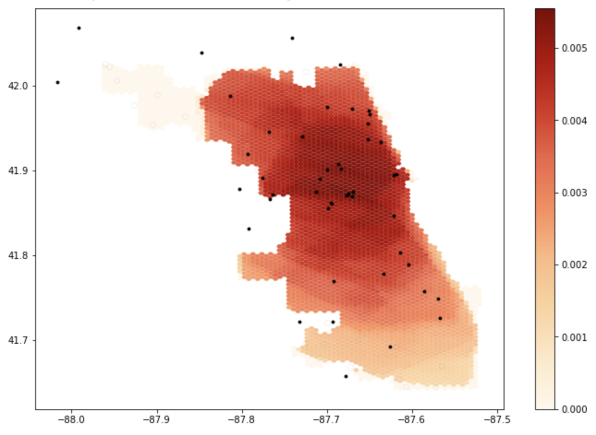
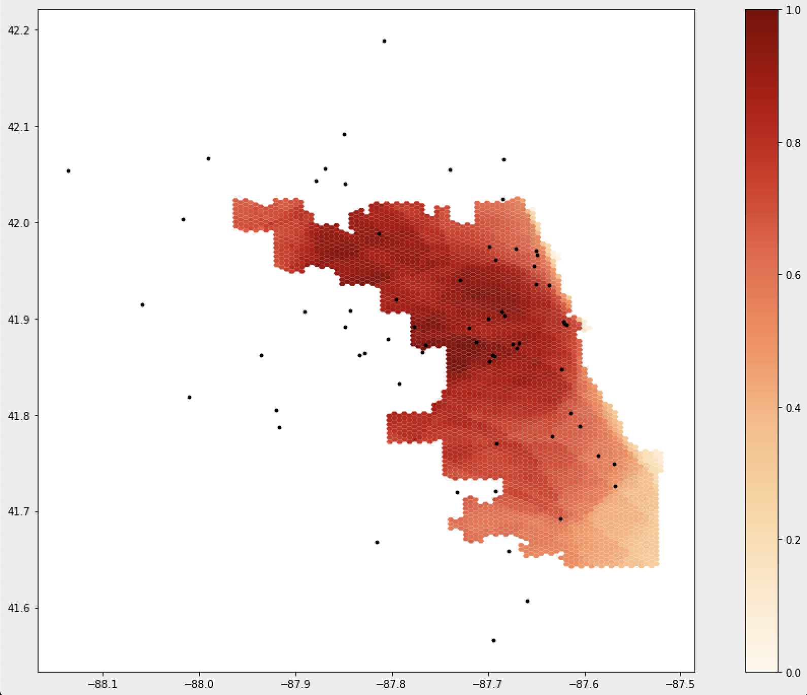

**Replication of**
# Rapidly Measuring Spatial Accessibility of COVID-19 Healthcare Resources: A Case Study of Illinois, USA

Original study *by* Kang, J. Y., A. Michels, F. Lyu, Shaohua Wang, N. Agbodo, V. L. Freeman, and Shaowen Wang. 2020. Rapidly measuring spatial accessibility of COVID-19 healthcare resources: a case study of Illinois, USA. *International Journal of Health Geographics* 19 (1):1–17. DOI:10.1186/s12942-020-00229-x.

Replication Author:
Emma Brown, Joe Holler, Kufre Udoh

Replication Materials Available at: [emmab725/RP-Kang](https://github.com/emmab725/RP-Kang)

Created: `19 May 2021`
Revised: `25 May 2021`

## Introduction
Kang et al. (2020)'s study analysis the spatial accessibility of healthcare during the COVID-19 pandemic in Chicago Illinois, using an enhanced two-step floating catchment area (E2SFCA) method. The analysis specifically compares the accessibility of hospitals to COVID-19 patients and populations at high risk. The current pandemic has overwhelmed healthcare systems, thus analysis mapping the accessibility of these resources is vital in order to identify what areas are under-serviced. Kang et al.'s goal in this study was to create an efficient, open source method that could help inform where resources were needed in a reproducible way.

The study found that ICU beds and ventilators are not evenly distributed throughout Illinois, and that those in central and northern Chicago were at much better offs at accessing healthcare than those in the southern part of the city. Kang et al. also found no significant difference between the access to beds and ventilators for at-risk populations and COVID-19 patients.

Reproducing studies like this is important in fact-checking, but also allows for further contributions, improvement and critique. This study aims to reproduce Kang et al.'s study using the same data and code (with some alteration). The accessibility of healthcare is an important and pressing issue, and the current pandemic has shown that it is important now more than ever to create efficient models of analyzing the spatial distribution and accessibility of these services.

## Materials and Methods
Materials and Methods briefly explaining and citing what data sources and computational resources were used for the study. The length/depth of this explanation may be similar to your review of the Twitter for Wildfire Hazards paper (Wang et al 2016).

Kang et al. (2020) used an enhanced two-step floating catchment area (E2SFCA) method, which first calculates a bed-to-population ratio for each hospital location, and then sums these ratios for residential locations where hospital locations overlap. This was done through a parallel computing strategy based on cyberGIS (cyber geographic information science and systems). The analysis was completed in Jupyter notebook using the pandas, numpy, geopandas, networkx, OSMnx, shapely, matplotlib, tqdm, folium, and multiprocessing packages.

The study uses four datasets: 1) Hospital location and service data (# of ICU beds and ventilators) and 2) COVID-19 confirmed case dataset from the Illinois Department of Public Health,  2) residential/population dataset from the US Census, and 4) road network data from OpenStreetMap.
The hospital dataset was pre-processed to exclude military, children, psychiatric, and rehabilitation hospitals, which may not provide health services to COVID-19 patients.

The conventional two-step floating catchment area (2SFCA) begins by first summing all people located within a catchment area of each healthcare service, which is based on a 30 minute travel time threshold. Then, the service-to-population ratio is calculated within the catchment. "Service" refers to ICU beds and/or ventilators. A ratio was calculated for both at-risk (defined as over age 50) as well as COVID-19 patients. The E2SFCA method accounts for the distance decay, by allowing for multiple travel time zones, such as 0–10, 10–20, and 20–30 min. Three weights (1, 0.68, and 0.22) were applied to each travel time zone, respectively. These value of these weights, are not explained in the paper. Accessibility was calculated as the sum of the service-to-puplation ratio. Next, the accessibility measurements were aggregated into hexagon grids. Hexagons were used to minimize orientation bias from edge effects. In the case of catchment areas that overlapped more than 50%, the values at each hexagon grid was aggregated.

The script to my analysis can be found [here](), and the full repository, which includes the data, can be found [here]().

### Changes to Methods
While the original study looks at both the state of Illinois and the city of Chicago, this reproduction looks just at Chicago using an original analysis code modified by [Joseph Holler](https://github.com/josephholler).

One issue with the initial code is that the road network was confined to the limits of Chicago. This meant that it could not consider hospital outside the city, which is an oversight considering that hospitals outside the city may be the closest healthcare services for some city residents. However, the original collection of hospital points were used, which included hospitals outside the city. This caused hospitals outside the city to be assigned to the node of the city's road network to which they were closest to, which misleadingly increased the healthcare services on the outskirts of the city.

To account for these hospitals in a more accurate way, this reproduction modifies the road network by including roads within a 24 kilometer buffer around the city. Further, there were a few errors in the OSM data, in the speed attribute, which did not allow the code to run. Shoutout to my classmate [Maja Cannavo](https://majacannavo.github.io/geog323/geog323main) who found a work-around to this issue and saved the class!

I also sought to lessen the steps for future reproduction by including the code to process the hospital data in the Jupyter Notebook, rather than having to pre-process the data. My goal for this was to more easily enable the analysis to other parts of the country. For this, I downloaded raw hospital data from [Homeland Security](https://hifld-geoplatform.opendata.arcgis.com/datasets/6ac5e325468c4cb9b905f1728d6fbf0f_0?geometry=94.933%2C-16.829%2C-125.849%2C72.120&selectedAttribute=TYPE), and then filtered the hospitals down by type, and then by those within a 15 mile buffer around the city. While this pre-processing ended up being successful (special thanks to [Kufre Udoh](https://kufreu.github.io/) for helping me work through some of the code!), I unfortunately was unable to use the data because it did not include ICU beds or COVID-19 patients. In future reproductions of this, you would first need to join this data to the hospitals, then run through the processing code. Thus, I still ended up having to use the pre-processed hospitals in my analysis, but it was still a fun exercise to play around with the code and I was very excited to see it work!

## Results and Discussion
### Accessibility of Healthcare Services in Chicago (Pre-Network Alteration)

Figure 1: The results of the initial notebook script without any changes. Areas that are darker have more accessibility to healthcare services.

### Accessibility of Healthcare Services (With Updated Road Network)

Figure 2: The results of the notebook script after accounting for a 24km buffer around the Chicago road network. Areas that are darker have more accessibility to healthcare services.

The maps above illustrate the spatial distribution of access around Chicago, and shows how not accounting for the road network outside of the city skews the perceived accessibility of services. As you can see, accessibility shifts once making the alteration to the road network and greatly increases accessibility in these areas.

Other adjustments to consider in the future are the values of the weights. Kang et al. (2020) did not provide a thorough explanation on the values of these weights, and it would be interesting to see how these analysis would change when using different values. It is important to justify why certain decisions are made when designing a procedure, which ensure that these processes stem from well-informed decisions. Especially considering something with serious implications such as healthcare accessibility, it is important to clearly state why certain decisions are made.

## Conclusions
The original study published by Kang et al. (2020) is a great example of a fairly reproducible, open source research. It also, however illustrates the importance of collaboration in open source work. While the original study provided a great framework for analyzing the accessibility of healthcare services, the changes made to the code help to improve the analysis and makes it more easily applicable to other areas of the country as well. By publishing the code and data used in the analysis alongside their paper, Kang et al. (2020) made replication a far less arduous task (see [this post](https://emmab725.github.io/resilience/RP-Malcomb-Report.html) which addresses some difficulties of replication), contributing to a future of open source GIScience that emphasizes transparency, collaboration, and growth. Models like this one which analyzes healthcare accessibility is especially important to share and collaborate on, as it can inform where inequity lies and improve healthcare systems.
