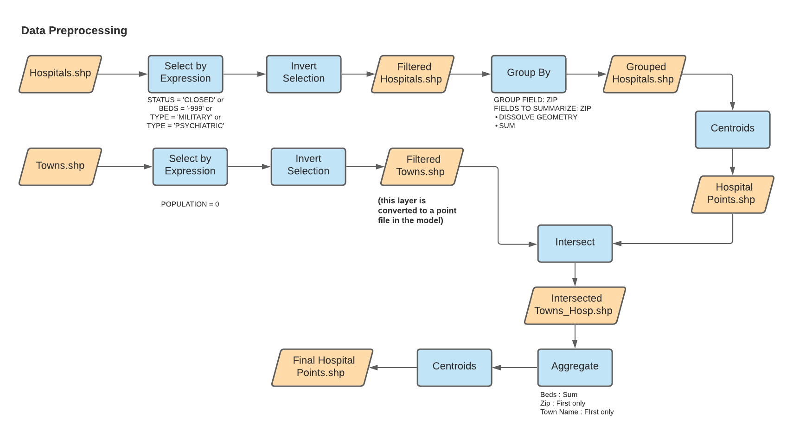
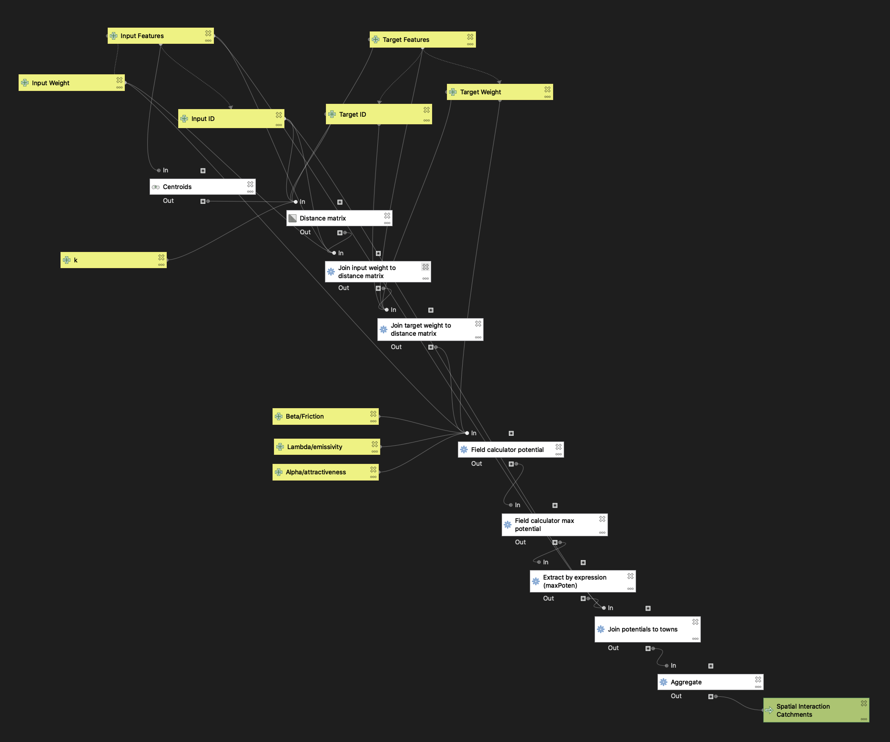
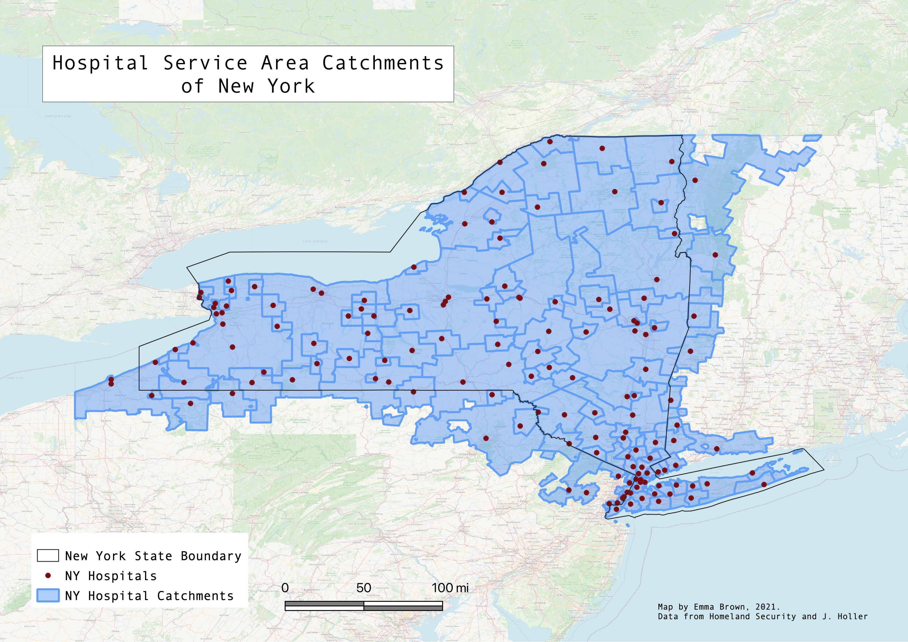

# *PURPOSE*

The gravity model of spatial interaction seeks to predict the amount of interaction between two places. This model can help us understand what areas are underserved by various services, which can in turn aid identifying sites for development. In this example, I explore emergency room and ICU service areas in the state of New York, to provide insight as to which areas have more/less hospital access. The model considers three parameters when determining the interaction between two places: the weight/attractiveness of the input (origin) feature, the weight/attractiveness of the destination (target) feature, and the distance between the origin and the target. This model takes both input and target layers and first creates a distance matrix to calculate the distance from the input to 20 (by default -- this can be adjusted in the model) of the closes points. These three factors are then applied to the formula (inputWeight)^λ * (targetWeight)^α / (distance)^β to calculate the potential for interaction, as referenced by Jean-Paul Rodrigues' [The Geography of Transport Systems](https://transportgeography.org/contents/methods/spatial-interactions-gravity-model/). This model allows for advanced parameters to adjust the exponents of the input and target weight.

In this specific example, input features are towns, while the target features are hospitals. The weight field for towns was population, while the weight field for hospitals were the number of beds, which were aggregated by zipcode prior to the analysis. However, there are myriad application of this model. Beyond just looking at hospital access, it would be interesting now during the Covid-19 pandemic to apply this gravity model to vaccine access and distribution. 

# *DATA*

This analysis uses hospital data acquired from [Homeland Security](https://hifld-geoplatform.opendata.arcgis.com/datasets/6ac5e325468c4cb9b905f1728d6fbf0f_0) which was processed prior to its use in the model to filter the data by the following criteria:
 1. Exclude hospitals that do not have a normal intensive care unit for public use (e.g. psychiatric or military hospitals)
 2. Exclude hospitals with missing data on the number of beds
 3. Exclude hospitals that are closed

Further, as aforementioned, the target hospitals were grouped by zip code, and the number of beds per zip code were summarized. These were then converted to centroid points to use in our analysis.

More detailed workflows on these processes is shown below:

Population data for New England: [netown.gpkg](assets/netown.gpkg) (compiled by J. Holler using TidyCensus)

Dartmouth Atlas of Health [boundary files](https://atlasdata.dartmouth.edu/downloads/supplemental#boundaries)

# *GRAVITY MODEL WORKFLOW*

The workflow for the creation of the gravity model is below:

# *RESULTS*

For this project, I zoomed in on New York State, the hospital catchments for which are shown below.

When comparing the the service areas created by my model to the Dartmouth Atlas' catchments, there is some variation (Webmap [here](assets/Webmap)). As anticipated, the regions of both models do not align perfectly, however, it is interesting to compare the two to see how they overlap in certain areas as a general way to check how my analysis compares to a far more well-established lab's. Obviously, there are many ways in which these types of models can vary and how they can improve based on what the user seeks to answer. For example, one way that this model may be improved is by using an OD distance matrix which calculates distances based on a given road network, rather than straight-line Euclidian distance as the model I've created does. This would allow for a more accurate measurement of travel time, which is definitely a factor that influences travel decisions. Further, there are variables beyond the scope of computer-based models that exist in everyday life such as weather, road construction, and injury severity that may sway an individual's decision to go to one hospital or another. However, this model is ultimately a useful tool to predict the interaction between two places and can be applied in many scenarios.
