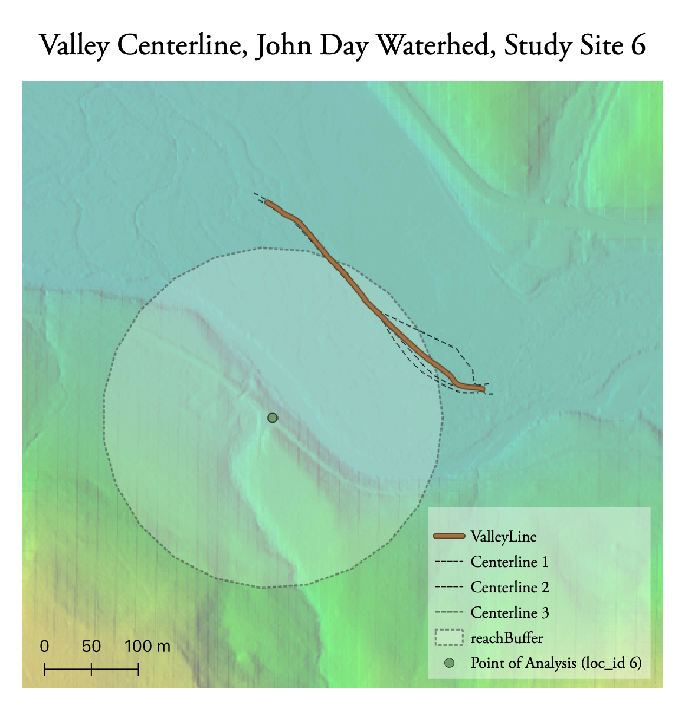

**Replication of**
# A classification of natural rivers

Original study *by* Rosgen, D. L.
*in* *CATENA* 22 (3):169–199. https://linkinghub.elsevier.com/retrieve/pii/0341816294900019.

and Replication by: Kasprak, A., N. Hough-Snee, T. Beechie, N. Bouwes, G. Brierley, R. Camp, K. Fryirs, H. Imaki, M. Jensen, G. O’Brien, D. Rosgen, and J. Wheaton. 2016. The Blurred Line between Form and Process: A Comparison of Stream Channel Classification Frameworks ed. J. A. Jones. *PLOS ONE* 11 (3):e0150293. https://dx.plos.org/10.1371/journal.pone.0150293.

Replication Authors:
Emma Brown, Zach Hilgendorf, Joseph Holler, and Peter Kedron.

Replication Materials Available [here](https://github.com/emmab725/RE-rosgen)

Created: `17 March 2021`
Revised: `24 March 2021`

## Introduction/Motivation

Understanding river morphology and its potential implications for the river's surrounding environment is crucial in many ways -- for land conservation, habitat restoration, building infrastructure and zoning, and water management -- to name a few. Classifying rivers allows researchers, conservationists, and engineers to draw quick conclusions about the river, allowing them to make informed decisions about their respective river projects. Rosgen's study, ***A classification of natural rivers***, classifies rivers into seven main categories (Level I classification), which then splits these rivers into more minute classifications based on the particle size at the study site (Level II classification). Rosgen's system is well-known and has become the most commonly used river classification as it provides a reproducible frame of reference of communication about the stream type. Furthermore, this classification aids in predicting a river's future behavior, provides a mechanism to easily compare streams, and explores the relationship between morphology and hydraulic sediment.
Kasprak et al. reproduced the study in ***The Blurred Line between Form and Process: A Comparison of Stream Channel Classification Frameworks*** (2016) which compared the Rosgen classification with three other classification methods: the River Styles Framework, the Natural Channel Classification, as well as a statistical classification. Kasprak et al. identifies where the models diverge in their methods to help understand the strengths and weaknesses that accompany each classification. The study concluded that the models were fairly consistent and that differences could be attributed to the spatial scale of input data, the requisite metrics and their order in completing a framework’s decision tree, whether the framework attempts to classify current or historic channel form.
The goal of this replication was to produce a Rosgen classification using GIS methods. While this comes with the risk of oversimplifying, creating a reproducible methodology in GIS allows for a much easier way of assessing a larger area in an efficient manner without having to visit the study site.

## Methods and Data

Our replication study focuses on the John Day Watershed in Oregon, the same site used in the Kasprak, et al. study. Each student in the class was assigned a stream in this watershed to focus on.

All procedures, code and material for this study can be found [here](https://github.com/emmab725/RE-rosgen).

Data:
- CHaMPS (Columbia Habitat Monitoring Program) data
- John Day Watershed Digital Elevation Model

First, GIS analysis was conducted in GRASS GIS, with specific instructions [here](https://github.com/emmab725/RE-rosgen/blob/main/procedure/protocols/1-Research_Protocol_GRASS.pdf). Using a MacOS system required the installation of [The Unarchiver app](https://theunarchiver.com) which allowed me to unzip large files as well as [XCode](https://developer.apple.com/xcode/) which enabled me to download GRASS plugins. Two models, one for [visualizing the data](https://github.com/emmab725/RE-rosgen/blob/main/procedure/code/visualize.gxm) and for [calculating centerlines](https://github.com/emmab725/RE-rosgen/blob/main/procedure/code/center_line_length_no_clip.gxm) were used to eliminate many steps in the workflow.

I then used R Studio for following code analyses and graph construction, the markdown file for which can be found [here](https://github.com/emmab725/RE-rosgen/blob/main/procedure/code/2-ProfileViewer.Rmd). Here, we constructed a graph showing the cross-sectional profile of the CHaMPs point, the longitudinal profile and flood-prone width.

These analyses provided the necessary criteria to classify the site based on Rosgen's methods:
- Entrenchment Ratio (Valley Width / Bankfull Width)
- Width / Depth Ratio (Bankfull With Mean / Bankfull Depth Mean)
- Sinuosity
- Slope
- Channel Material

Rosgen's classification scheme is shown below:

## Unplanned Deviations from the Protocol
As stated above, I had some trouble installing plug-ins and unzipping large files with my MacOS system. Further, my site buffer was not large enough to include both valley banks, so I used an altered model that did not clip the centerlines to the buffer zone. Because of this, the lengths of these lines were more subjective and based off of my ability to digitize lines of similar lengths. The slope calculated in the R Studio notebook also was noticeably erroneous. Because it averaged the slope for the study area, large outliers due to subjective digitizing skewed the average slope. Thus, I simply calculated a new slope by referencing the longitudinal profile's rise/run.

The randomly assigned location for this replication, location id 6, had multiple points recorded in the CHaMP data from different years. I elected to use the data from the most recent year, 2016.

## Replication Results

Figures to Include:

Tables to Include:

Table 1. Site Measurements
| Variable | Value | Source |
| :-: | :-: | :-: |
| Bankfull Width | 17.5117 m | CHaMPS |
| Bankfull Depth Average | 0.5937 m | CHaMPS |
| Bankfull Depth Max | 1.40560 m | CHaMPS |
| Valley Width | 286 m | Estimated from cross-sectional profile|
| Valley Depth | 1.1874 m | CHaMPs |
| Stream/River Length | 392.04 m | Digitized in GRASS |
| Valley Length | 309.8 m | Digitized in GRASS |
| Median Channel Material Particle Diameter | 28 mm | CHaMPS |

Table 2. Rosgen Level I Classification
| Criteria | Value |
| :-: | :-: |
| Entrenchment Ratio | 16.3319 |
| Width / Depth Ratio | 29.4958 |
| Sinuosity | 1.1682 |
| Level I Stream Type | C |

Table 3. Rosgen Level II Classification
| Criteria | Value |
| :-: | :-: |
| Slope | 0.0053 |
| Channel Material | Gravel |
| Level II Stream Type | C4 |

## Discussion

My analyses determined the study site (location id 6, Middle Fork John Day River, CHaMPS id CBW05583-415218) to have a Level I stream classification C, and Level II classification of C4. This diverges from the Rosgen classification in the CHaMPS data attribute table, which is E4. This indicates that our classifications diverge at the sinuosity level. However, this was confusing to me because I referenced the sinuosity stated in the CHaMPS data, so my assumption is that my classification would be the same. Kasprak et al. identified my area to be a C3b, indicating that our analyses were quite similar but diverge at the slope. They found poor and moderate agreement between their classification and the other methods for this study site, which perhaps is a little reassuring and may indicate that this area is difficult to classify. This also points to how specific the Rosgen classification is. Each branch of the classification provides specific avenues in concluding the classification and the scheme is very hierarchical, which means that unusual stream types are often not able to fit within this framework.

Errors could have also risen because of the granularity of the data used -- Kasprak used 0.1 m DEM resolution, while our analyses used 1 m resolution. Further, digitizing can be very subjective, especially for someone who is not a geologist or well-acquainted with the study area. This made it difficult to identify the river banks and valley edges, which could be a source of error for the analysis.

## Conclusions

River classifications are incredibly important for a variety of reasons, and using GIS to classify streams is an efficient way to conclude and communicate results on a large scale without having to travel to the study site. Further, the incredibly dynamic nature of rivers entails that they must be re-classified often, thus having a streamlined methodology to do so is imperative in order to have up-to-date data. However, this analysis points to uncertainty and subjectivity within GIS analysis that is difficult to mitigate. Kasprak et al. also illustrated the importance of comparing methods and highlighted that even well thought-out and supported classification methods can have poor agreement. Thus illustrates the necessity of understanding what parts of the classification scheme are important in specific circumstances in order to have the most meaningful impact.

## References

Include any referenced studies or materials in the [AAG Style of author-date referencing](https://www.tandf.co.uk//journals/authors/style/reference/tf_USChicagoB.pdf).

####  Report Template References & License

This template was developed by Peter Kedron and Joseph Holler with funding support from HEGS-2049837. This template is an adaptation of the ReScience Article Template Developed by N.P Rougier, released under a GPL version 3 license and available here: https://github.com/ReScience/template. Copyright © Nicolas Rougier and coauthors. It also draws inspiration from the pre-registration protocol of the Open Science Framework and the replication studies of Camerer et al. (2016, 2018). See https://osf.io/pfdyw/ and https://osf.io/bzm54/

Camerer, C. F., A. Dreber, E. Forsell, T.-H. Ho, J. Huber, M. Johannesson, M. Kirchler, J. Almenberg, A. Altmejd, T. Chan, E. Heikensten, F. Holzmeister, T. Imai, S. Isaksson, G. Nave, T. Pfeiffer, M. Razen, and H. Wu. 2016. Evaluating replicability of laboratory experiments in economics. Science 351 (6280):1433–1436. https://www.sciencemag.org/lookup/doi/10.1126/science.aaf0918.

Camerer, C. F., A. Dreber, F. Holzmeister, T.-H. Ho, J. Huber, M. Johannesson, M. Kirchler, G. Nave, B. A. Nosek, T. Pfeiffer, A. Altmejd, N. Buttrick, T. Chan, Y. Chen, E. Forsell, A. Gampa, E. Heikensten, L. Hummer, T. Imai, S. Isaksson, D. Manfredi, J. Rose, E.-J. Wagenmakers, and H. Wu. 2018. Evaluating the replicability of social science experiments in Nature and Science between 2010 and 2015. Nature Human Behaviour 2 (9):637–644. http://www.nature.com/articles/s41562-018-0399-z.
